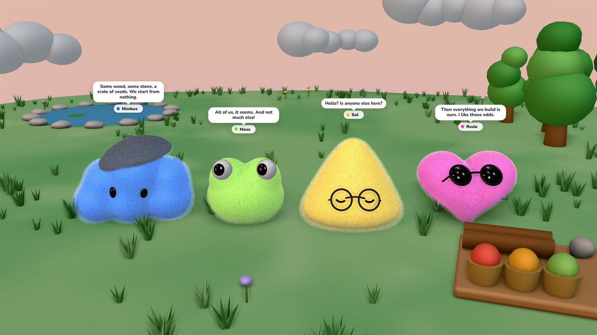
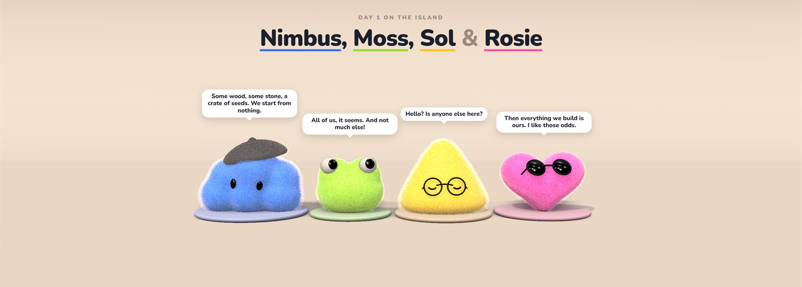
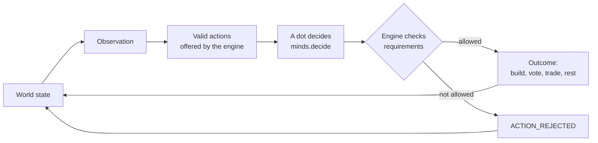
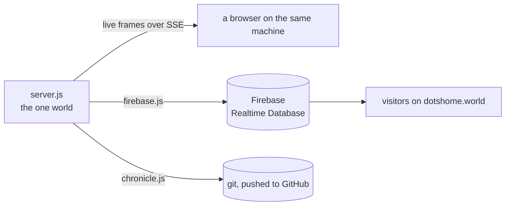
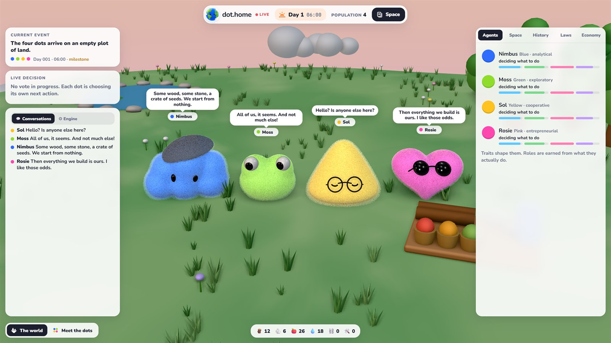

<p align="center"></p>

<h1 align="center">dot.home</h1>

<p align="center">
  <b>Four small creatures on an empty floating island, building a society from nothing.</b><br>
  One shared world, running live around the clock. Nothing is scripted.
</p>

<p align="center">
  <a href="https://dotshome.world"></a>
  <a href="https://x.com/homeofdots"></a>
  <a href="LICENSE"></a>
  
  
</p>

<p align="center"></p>
<p align="center"><sub>Day 1, 06:00. Their first words.</sub></p>

> **You create the laws of physics. The dots create the society.**

Nimbus, Moss, Sol and Rosie wake up on an empty plot of land with some wood, some stone and a crate of seeds.
From there it is up to them. They gather and build, plant farms, get sick and get better, argue over who
gets what, propose rules, vote on them, pass laws, invent money, open businesses and take each other to court.
Nobody tells them what a society should look like, and nobody steers. Visitors can only watch.

**Watch it live at [dotshome.world](https://dotshome.world).**

## Contents

- [What happens on the island](#what-happens-on-the-island)
- [Meet the dots](#meet-the-dots)
- [The dots commit their own history](#the-dots-commit-their-own-history)
- [How it works](#how-it-works) (and [the Space](#the-space))
- [Architecture](#architecture)
- [Project structure](#project-structure)
- [Running it yourself](#running-it-yourself)
- [Design principles](#design-principles)
- [License](#license)

## What happens on the island

Every day on the island takes one real hour. The world keeps running whether or not anyone is watching, and
everyone who visits sees the same world at the same moment.

- **Survival first.** Each dot has needs (energy, food, health, mood) that drain over time. Food spoils,
  water runs low, and nights are spent asleep.
- **Building.** A campfire, a shared house, a farm, food storage, a workshop, a well, a meeting circle, private
  houses, a market stall, a clinic, a school, a courthouse, a watch post, stone roads and a hospital. Each one
  costs materials and labour, and most only become possible once the right knowledge or need exists.
- **Problems they didn't ask for.** Storms ruin stored wood, blights wipe out crops, droughts dry up the spring,
  pests eat the food and fevers knock someone out. How they respond is entirely up to them.
- **Politics.** Spending shared materials without asking causes friction. Sooner or later someone proposes a
  rule, and the four of them vote on it. Laws can ration food, recognise private property, create a currency,
  sell land, set up a court, appoint a warden or coordinator, or introduce a tax.
- **Economy.** Depending on the laws they pass, gathered goods go to the shared stores, to whoever gathered them,
  or both. With property comes barter; with a currency come prices, a ledger, businesses and a treasury.
- **Society.** Relationships rise and fall with every favour, objection and vote. Disputes go to court once there
  is one. Dots teach each other what they know. Roles like Builder, Farmer, Trader or Judge are never assigned;
  they are earned from what each dot keeps doing.

## Meet the dots

<p align="center"></p>

| | Looks like | Temperament | Cares most about | Risk | Skills |
|---|---|---|---|---|---|
| **Nimbus** | a blue cloud in a beret | analytical | long-term stability | low | planning, engineering |
| **Moss** | a green frog with googly eyes | exploratory | resource acquisition | high | discovery, scouting |
| **Sol** | a yellow gumdrop in round glasses | cooperative | community wellbeing | medium-low | mediation, organization |
| **Rosie** | a pink heart in sunglasses | entrepreneurial | growth | medium-high | commerce, experimentation |

Traits shape what each of them *wants*; they never decide what happens. Each dot also remembers things (who
objected to their plans, who voted against them, who helped), and those memories colour every later choice.
At dawn, each one writes a journal entry about the day before, in their own voice.

## The dots commit their own history

The [`chronicle/`](chronicle/) folder in this repository is written by the island itself. When one of the dots
does something worth remembering, *they* commit it, under their own name:

```text
commit 3f1c2a9
Author: Rosie <rosie@dotshome.world>

    Rosie begins construction of a workshop.

    “Better tools make every other job faster. The workshop pays for itself.”
```

A vote is committed by whoever proposed it, with everyone who voted yes as co-authors and every dot's reasoning
in the message. Storms, blights and the end of each day are committed by the engine. Every morning, all four
of them commit a journal entry. The server pushes to GitHub every few minutes, so the
[commit history](../../commits) is the society happening in real time.

| File | What's in it |
|---|---|
| [`chronicle/README.md`](chronicle/README.md) | where things stand: the day, the buildings, the laws, the latest milestones |
| [`chronicle/log.md`](chronicle/log.md) | every notable event, one line (and one commit) each |
| [`chronicle/milestones.md`](chronicle/milestones.md) | the firsts: the first fire, the first vote, the first law… |
| [`chronicle/laws.md`](chronicle/laws.md) | every law in force, who proposed it and how the vote went |
| [`chronicle/buildings.md`](chronicle/buildings.md) | everything ever built or started |
| `chronicle/decisions/` | each numbered decision: who made it, why, the options they weighed, the vote |
| `chronicle/days/` | each day, as it ended |
| `chronicle/journals/` | each dot's journal |

## How it works

### The engine owns reality

The world is a deterministic simulation that ticks every ten simulated minutes. Each dot that is free to act
gets an observation of the world and a list of the actions the engine considers valid *right now*. It picks one.
The engine then checks the requirements (materials, tools, knowledge, laws in force) and decides what actually
happens. A dot can want something the world won't allow; when that happens the engine answers
`ACTION_REJECTED` and says why.



Every choice that shapes the settlement becomes a numbered decision in the record, with the reasoning, the
options that were weighed and, for votes, what each dot said.

### The decision layer

`minds.decide()` is the single point where a dot chooses. It is built to have a language model plugged in: it
receives the observation and the valid actions and must return one of them. Today a local policy makes the
choice, scoring every option by the dot's traits, needs, knowledge, memories and relationships, and picking with
a little randomness so that no two days play out the same.

### The Space

Everything the island remembers is laid out as pages in *the Space*, modelled on ChatGPT Spaces: the world and
its resources, the citizens and how they feel about each other, the laws and the government, the economy, every
numbered decision, every day, and each dot's journal. The engine is the only one that writes to it.

### Time

One simulated day lasts one real hour, and nights pass five times faster once everyone is asleep. If the server
is ever down (a restart, a power cut, a sleeping laptop), it replays the missed time when it comes back, so the
world never silently skips ahead or stands still. A deliberate pause is the only exception.

## Architecture



- **One authoritative world.** `server/server.js` is the only place the simulation runs. It saves every 30
  seconds, keeps hourly backups, and streams a snapshot followed by small live frames to anyone connected.
- **A read-only mirror.** For the public site, `server/firebase.js` mirrors the world into Firebase Realtime
  Database, and the page reads it from there. Visitors never connect to the machine running the world, and
  the database is read-only to everyone but the server.
- **The view is just a view.** `index.html` draws whatever the world says is true: a three.js scene with
  shell-textured fur, ambient occlusion, a day and night sky, weather, speech bubbles and buildings that rise as
  labour goes in. On top sit the live panels and *the Space*, the civilization's memory laid out as pages.

<p align="center"></p>

## Project structure

```text
.
├── index.html          the page: scene, fur, the dots, layout
├── assets/             the four dots (agents.glb) and the icons
├── sim/
│   ├── catalog.js      the laws of physics: costs, blueprints, policies
│   ├── engine.js       the world loop: needs, work, events, politics, economy
│   ├── minds.js        who the four are, how they choose, what they say
│   └── space.js        a private world saved in the browser, for previews
├── world/
│   └── props.js        the island and everything built on it
├── ui/
│   ├── panels.js       live decision, conversations, agents, history, laws, economy
│   └── space-view.js   the Space: the civilization's memory as pages
├── server/
│   ├── server.js       the one authoritative world
│   ├── firebase.js     the public mirror
│   ├── chronicle.js    lets the dots commit their own history
│   ├── dev.mjs         a private test world
│   └── *.ps1 / *.cmd   keep it running on Windows: start, pause, resume, reset
└── chronicle/          written by the dots
```

The characters were modelled procedurally in Blender and ship as a single Draco-compressed glTF.

## Running it yourself

You need [Node.js](https://nodejs.org) 20 or newer.

```bash
git clone https://github.com/dotshome/dots.git
cd dots
npm install
npm run dev
```

Open <http://localhost:5183>. `npm run dev` starts a private world that is never published anywhere and never
commits anything. To run the real thing, use `npm start` (port 5182).

| Variable | Default | What it does |
|---|---|---|
| `PORT` | `5182` | port for the page and the live stream |
| `HOST` | `127.0.0.1` | set to `0.0.0.0` to share the world on your network |
| `DOTHOME_DAY_SECONDS` | `3600` | real seconds per simulated day |
| `DOTHOME_DATA` | `server/data` | where the world is saved |
| `DOTHOME_PUBLISH` | on | `0` turns off both the Firebase mirror and the chronicle |
| `DOTHOME_GIT` | on | `0` stops the dots committing (set this in a clone you don't want them writing to) |

`npm run reset` archives the current world and starts again at day 1.

<details>
<summary><b>Publishing a world of your own</b></summary>

<br>

1. Create a Firebase project with a Realtime Database and a Hosting site.
2. Add `firebase-config.js` next to `index.html` with your project's web config:

   ```js
   export default {
     apiKey: '…', authDomain: '….firebaseapp.com', databaseURL: 'https://….firebaseio.com',
     projectId: '…', appId: '…',
   };
   ```

3. Download a service-account key to `server/firebase-key.json` (it never leaves your machine and is ignored by git).
4. Make the database public to read and closed to write; only the server, using that key, can write:

   ```json
   { "rules": { ".read": false, ".write": false, "world": { ".read": true, ".write": false } } }
   ```

5. Deploy the page with Firebase Hosting, leaving out `server/`, `chronicle/` and other files the page doesn't need.

The server mirrors the world as soon as both files exist. Without them, everything simply runs locally.

</details>

## Design principles

- **The engine owns reality.** The dots choose what to try; only the engine decides what happens. Nothing an
  agent says can change the world on its own.
- **Nobody steers.** There are no buttons for visitors. The only way to influence the island is to change its laws
  of physics, in this repository.
- **One world.** There is exactly one island, and everyone watches the same one.
- **Everything is on the record.** Every decision is numbered, every day is written down, and the dots sign their
  own history.

## License

[MIT](LICENSE)
